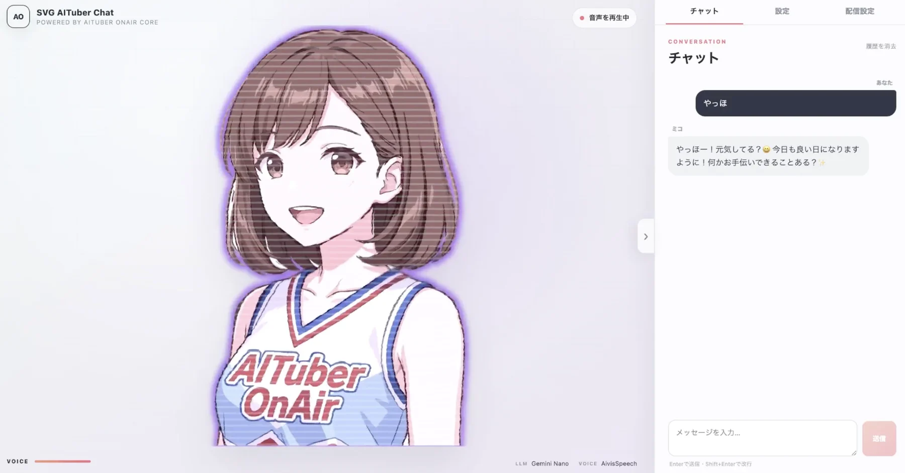

# SVG AITuber Chat



[English](./README.md) | **日本語**

**SVG AITuber Chat**は、アニメーション付きSVGアバターと、npmで公開されている[`@aituber-onair/core`](https://www.npmjs.com/package/@aituber-onair/core)を組み合わせたローカル向けデモです。テキストチャット、TTS、音声解析によるリップシンク、SVG演出、YouTube Liveコメントへの自動返答に対応しています。

## 主な機能

- AITuber OnAir Coreが対応するLLMとのチャット
- 対応TTSエンジンによる音声返答
- 再生中の実音声を使った口パク
- まばたき、呼吸、首振り、髪揺れのアニメーション
- 返答の感情（happy、sad、angry、surprised）に合わせた目、眉、口、頬、漫符の切り替え
- うなずき、首かしげ、ジャンプなどのジェスチャーと、考え中の視線
- 線画、ネオン、グリッチ、波打ち、登場アニメーションなどのSVG演出
- 白フチ、リムライト、ポスター調、オーラ、影、髪色の変更、パーティクル、集中線とハーフトーンの背景
- YouTube Liveコメントの取得と順番による自動返答
- コメントのキーワードに合わせた表情、ジェスチャー、パーティクル
- 配信用に操作パネルを折り畳む表示

## 起動方法

```sh
cd svg-aituber-chat
npm install
npm run dev
```

`http://localhost:5173/`を開き、設定画面でLLMとTTSエンジンを選択して、必要なAPIキーを入力します。

設定はブラウザの`localStorage`に保存されます。このデモはローカル利用を想定しています。公開サービスに発展させる場合は、APIキーをブラウザに保存せず、安全なバックエンド経由でリクエストしてください。

画面中央の矢印ボタン、または`Esc`キーで操作パネルを畳み、SVGアバターを配信画面全体に表示できます。

## YouTube Liveコメント

1. Google CloudでYouTube Data API v3を有効にし、APIキーを作成します。
2. **配信設定**タブにAPIキーとYouTube LiveのURLまたは動画IDを入力します。
3. 取得間隔を選び、コメント取得を開始します。

コメントは最大50件まで待機します。LLMが処理中、または音声が再生中の場合、後から取得したコメントは待機し、古いものから順に処理されます。コメントへの返答開始時に、選択中の登場演出を再生することもできます。

YouTube連携は、[AITuber OnAirのReact PSD Example](https://github.com/shinshin86/aituber-onair/tree/main/packages/core/examples/react-psd-app)の構成と動作を参考に実装しています。

配信設定の「コメントのキーワードに反応する」を有効にすると、コメントに含まれる語に応じてアバターが反応します。たとえば「かわいい」ではハートが飛び、「888」では拍手のマークが出て、「草」では笑うジェスチャーをします。

## 表情と演出の確認用URLパラメータ

URLにパラメータを付けると、LLMやTTSを設定しなくても表情や演出を固定して表示できます。複数を`&`でつなげて指定できます。

| パラメータ | 内容 |
| --- | --- |
| `?emotion=happy` | 表情を固定します。`happy`、`sad`、`angry`、`surprised`、`relaxed`、`neutral`を指定できます。 |
| `?mouth=0.7&mouthw=1.25` | 口の開き（0〜1）と横幅（0.75〜1.25）を固定します。 |
| `?gesture=nod&gt=0.35` | ジェスチャー（`nod`、`tilt`、`jump`、`laugh`）を進行度0〜1の位置で止めます。 |
| `?thinking=1` | 考え中の視線にします。 |
| `?outline=sticker`、`?rim=1`、`?aura=1`、`?shadow=1` | 白フチ、リムライト、オーラ、影を表示します。 |
| `?visual=poster` | ポスター調で表示します。 |
| `?visual=halftone` | 暗部に漫画調のドットを重ねます。 |
| `?visual=duotone&mood=dramatic` | 明るさを2〜3色に置き換えて表示します。配色は色調（`mood`）の設定で変わります。 |
| `?reveal=dissolve&rp=0.5` | 登場演出を進行度0〜1の位置で止めます。 |
| `?hue=120` | 髪の色相を-180〜180度の範囲で回します。 |
| `?particles=heart&pt=0.5` | パーティクル（`heart`、`star`、`petal`、`clap`）を進行度0〜1の位置で止めます。 |
| `?backdrop=focusLines` | 背景に集中線（`focusLines`）またはハーフトーン（`halftone`）を表示します。 |
| `?comment=かわいい` | 起動の1秒後に、指定した文をコメントとして1回だけ反応させます。 |
| `?wobble=full&wseed=3` | アバター全体（`full`）または輪郭だけ（`edge`）を手描き風に揺らします。`wseed`でノイズの種を固定できます。 |
| `?hairfx=stars` | 髪の内側に模様を表示します。`stars`、`stripes`、`hologram`を指定できます。`hologram`の角度はポインター位置で変わります。 |
| `?shine=0.5` | 斜めに横切る光の帯を進行度0〜1の位置で止めます。 |
| `?bg=dark` | 背景色を`white`、`dark`、`green`から選びます。 |
| `?t=1.5&mx=0&my=0` | アニメーションの時刻とポインター位置を固定します。 |
| `?blink=1`、`?debug=1`、`?flat=1` | まばたき中で固定、領域の枠を表示、分割前のSVGをそのまま表示します。 |

## 音声・口パクテスト

**音声・口パクテスト**ボタンは、選択中のTTSエンジンでテスト文を発話し、返された音声から口の動きを生成します。

- 外部TTSエンジンでは、テスト時に実際のAPIリクエストが発生します。
- Web Speech APIは音声バッファを取得できないため、音声解析型リップシンクに対応しません。
- `none`エンジンは音声を再生しません。
- Fish AudioはローカルのViteプロキシ経由で呼び出されます。ブラウザのCORS制限がある他のプロバイダーも、同様のローカルプロキシが必要になる場合があります。

## Mikoアバター

同梱の`miko.svg`とデモ画像には、AITuber OnAir公式キャラクターのMikoが描かれています。SVGは、このアプリケーションサンプルの一部として同梱するためにベクター化・調整されたアバター素材です。

Miko関連ファイルには、このリポジトリのMIT Licenseは適用されません。利用には[Mikoキャラクター利用ガイドライン](https://miko.aituberonair.com/)が適用されます。ガイドラインでは、ソフトウェア、アプリ、ゲーム、動画、Webサイトなどの作品の一部としての改変・再配布は許可されていますが、素材単体や素材集としての再配布は禁止されています。このリポジトリにおける要約は[MIKO_ASSET_TERMS.md](./MIKO_ASSET_TERMS.md)を参照してください。

## 開発時の確認

```sh
npm run typecheck
npm run test
npm run build
```

## セキュリティ上の注意

- 自分のAPIキーを使用し、リポジトリにはコミットしないでください。
- YouTube Liveコメントは信頼できない外部入力です。このサンプルでは、コメントを会話データとして区切り、モデルに指示として扱わないよう促しています。公開サービスに発展させる場合は、モデレーションと安全対策を追加してください。
- 利用前に、各プロバイダーの料金、データの取り扱い、CORSの要件を確認してください。

## ライセンス

このリポジトリのソースコードは[MIT License](./LICENSE)で利用できます。

Mikoのキャラクター素材はMIT Licenseの対象外であり、[Mikoキャラクター利用ガイドライン](https://miko.aituberonair.com/)が適用されます。
